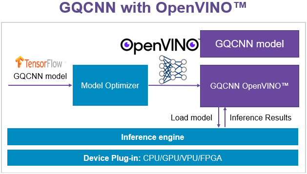

Enabling OpenVINO™
~~~~~~~~~~~~~~~~~~

This tutorial introduces how to enable OpenVINO™ for GQCNN deployment on Intel® devices.

Intel® Distribution of OpenVINO™ (Open Visual Inference & Neural network Optimization) toolkit, based on convolutional neural networks (CNNs), extends computer visoin workloads across Intel® hardware (including accelerators) and maximizes performance. The toolkit enables deep learning inference at the edge computation, and supports heterogeneous execution across various compution vision devices -- CPU, GPU, Intel® Movidius™ NCS2, and FPGA -- using a **common** API.

Install OpenVINO™ Toolkit
=========================
The toolkit is available from open source project `Intel® OpenVINO™ Toolkit`_.

.. note:: GQCNN uses two layers, RandomUniform and Floor, which are not supported by the 2019_R3 release of OpenVINO™. `PR #338 <https://github.com/opencv/dldt/pull/338>`_ adds the support for these two layers.

You may get start with `Build Inference Engine`_. The ``Introduction`` section lists supported device types. The ``Build on Linux* Systems`` section tells how to build and install the toolkit. Here're the CMake options for reference. Need adaption to your specific environment. ::

  $ cmake -DCMAKE_BUILD_TYPE=Release -DCMAKE_INSTALL_PREFIX=/usr/local -DGEMM=OPENBLAS -DBLAS_INCLUDE_DIRS=/usr/include/x86_64-linux-gnu -DBLAS_LIBRARIES=/usr/lib/x86_64-linux-gnu/openblas/libblas.so -DENABLE_MKL_DNN=ON -DENABLE_CLDNN=ON -DENABLE_PYTHON=ON -DPYTHON_EXECUTABLE=`which python3.6` -DPYTHON_LIBRARY=/usr/lib/x86_64-linux-gnu/libpython3.6m.so -DPYTHON_INCLUDE_DIR=/usr/include/python3.6 ..

Then install the ``Model Optimizer``. ::

  $ cd model_optimizer
  $ sudo pip3 install -r requirements*.txt

And setup environment for the toolkit. ::

  $ export InferenceEngine_DIR=<path to dldt>/inference-engine/build
  $ export LD_LIBRARY_PATH=$LD_LIBRARY_PATH:<path to dldt>/inference-engine/bin/intel64/Release/lib
  $ export PYTHONPATH=<path to dldt>/inference-engine/bin/intel64/Release/lib/python_api/python3.6:<path to dldt>/model-optimizer:$PYTHONPATH

Freeze a GQCNN Model
====================
A frozen graph file is expected by the Model Optimzer of OpenVINO™. This is done in ``gqcnn.model.tf.GQCNNTF.initialize_network()`` right after the graph is built. Seek into the code pieces below. ::

  # Freeze graph. Make it 'True' to freeze this graph
  if False:

Switch the ``if`` condition to ``True``, run an example policy with a specific GQCNN model (refer to ``scripts/policies/run_all_dex-net_<model_name>_examples.sh``), the frozen graph will be created into the file named ``inference_graph_frozen.pb``

Convert a GQCNN Model
=====================
``mo_tf.py`` is the Model Optimizer script for converting a Tensorflow model. ::

  $ sudo python3 <path to dldt>/model-optimizer/mo_tf.py --input_model inference_graph_frozen.pb --data_type FP16 --output_dir <path to gqcnn>/models/OpenVINO/<model_name>/FP16
  $ sudo python3 <path to dldt>/model-optimizer/mo_tf.py --input_model inference_graph_frozen.pb --data_type FP32 --output_dir <path to gqcnn>/models/OpenVINO/<model_name>/FP32

Parameters passed to the conversion script:
  #. ``input_model`` the frozen tensorflow model to be converted.
  #. ``output_dir`` the directory of the converted model.
  #. ``data_type`` data type of the converted model.

For more detail instructions on model conversion, refer to the `OpenVINO™ Docs`_.

.. note:: ``gqcnn.model.openvino.GQCNNOpenVINO.load_openvino()`` expect to load an OpenVINO model from ``models/OpenVINO/<model_name>/FP16``, where ``model_name`` comes from the original GQCNN model, e.g. ``GQCNN-4.0-SUCTION``, ``GQ-Suction``, etc.

Evaluate the OpenVINO™ Model with Example Policies
==================================================
Now the GQCNN model has been successfully converted into OpenVINO™ model. You may evaluate the GQCNN OpenVINO™ model with the example policy. Seek ``cfg/examples/replication/dex-net_<model_name>.yaml`` for the below configure: ::

  # openvino: OFF|CPU|GPU|MYRIAD
  openvino: OFF

Toggle ``openvino`` among CPU, GPU, or MYRIAD. This configure specifies the target device type for the GQCNN inference to execute (supported device types listed in the ``introduction section`` of `Build Inference Engine`_). Then run the example policy in the same way as given in ``scripts/policies/run_all_dex-net_<model_name>_examples.sh``, e.g. ::

  $ python3 examples/policy.py GQCNN-4.0-SUCTION --depth_image data/examples/clutter/phoxi/dex-net_4.0/depth_0.npy --segmask data/examples/clutter/phoxi/dex-net_4.0/segmask_0.png --config_filename cfg/examples/replication/dex-net_4.0_suction.yaml --camera_intr data/calib/phoxi/phoxi.intr

.. _Intel® OpenVINO™ Toolkit: https://github.com/opencv/dldt
.. _Build Inference Engine: https://github.com/opencv/dldt/blob/2019/inference-engine/README.md
.. _OpenVINO™ Docs: https://docs.openvinotoolkit.org/latest/_docs_MO_DG_prepare_model_convert_model_Convert_Model_From_TensorFlow.html
