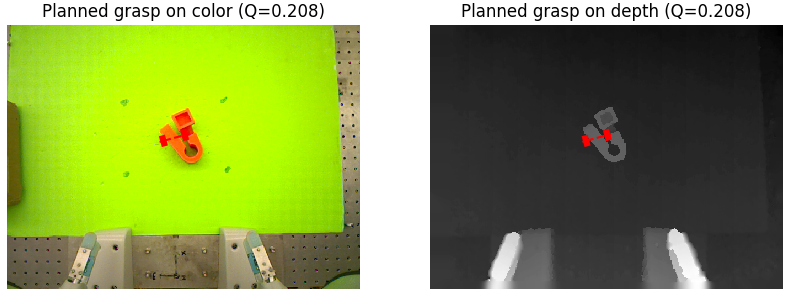

Grasp Planning
~~~~~~~~~~~~~~
Grasp planning involves searching for the grasp with the highest predicted probability of success given a point cloud.
In the `gqcnn` package this is implemented as a policy that maps an RGBD (color + depth) image to a 6-DOF grasping pose by maximizing the output of a GQ-CNN with the `Cross Entropy Method`_. 
For details, see our `ICRA 2017 workshop abstract`_.

This part of the tutorial walks through the script `policy.py`_ which is included in the `gqcnn` repository under examples/.
The corresponding template configuration file is `cfg/examples/policy.yaml`.

.. _Cross Entropy Method: https://en.wikipedia.org/wiki/Cross-entropy_method
.. _ICRA 2017 workshop abstract: https://github.com/BerkeleyAutomation/dex-net/raw/gh-pages/docs/dexnet_icra2017_lecom_workshop_abstract.pdf
.. _policy.py: https://github.com/BerkeleyAutomation/gqcnn/blob/dev_jeff/examples/policy.py

Edit the Configuration File
---------------------------

First, update the parameters of your configuration file (ex. `policy.yaml`) to point to a GQ-CNN model::

	policy:
	  gqcnn_model: /path/to/your/model/

For example, this could be the path to the model trained in the previous example (e.g. `/home/user/Data/models/grasp_quality/model_ewlohgukns`)

Run the Example Python Script
-----------------------------
From a new terminal run the following out of the root of your `gqcnn` repo::

	python examples/policy.py --config-filename /path/to/your/policy/configuration

You should see a sequence of images similar to these:
                        
.. image:: ../images/cem.png
   :height: 800px
   :width: 800 px
   :scale: 100 %
   :align: center

The final planned grasp will be overlayed on the original color and depth images

You can also try out grasp planning on multiple objects by changing the input data directory in the configuration file::

	sensor:
	  image_dir: data/rgbd/multiple_objects

ROS Package
-----------

We developed a ROS service for grasp planning with GQ-CNNs. The service takes as input a color image, depth image, camera info topic, and bounding box for the object in image space, and returns a parallel-jaw gripper pose relative to the camer along with a predicted probability of success. This has been tested on our setup with ROS Jade on Ubuntu 14.04

To illustrate using our ROS service, we've shared the ROS node that we use to plan grasps for and control an ABB YuMi on our local setup. This file should be considered READ-ONLY as it uses parameters specific to our setup. If you have interest in replicating this functionality on your own robot, please contact Jeff Mahler (jmahler@berkeley.edu) with the subject line: "Interested in GQ-CNN ROS Service".

