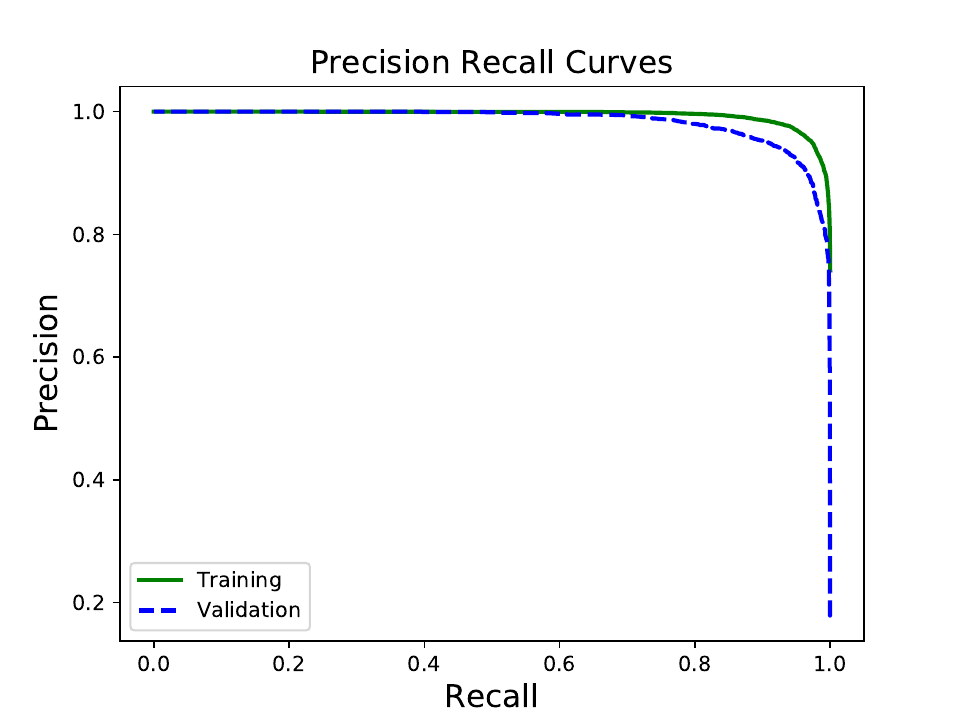
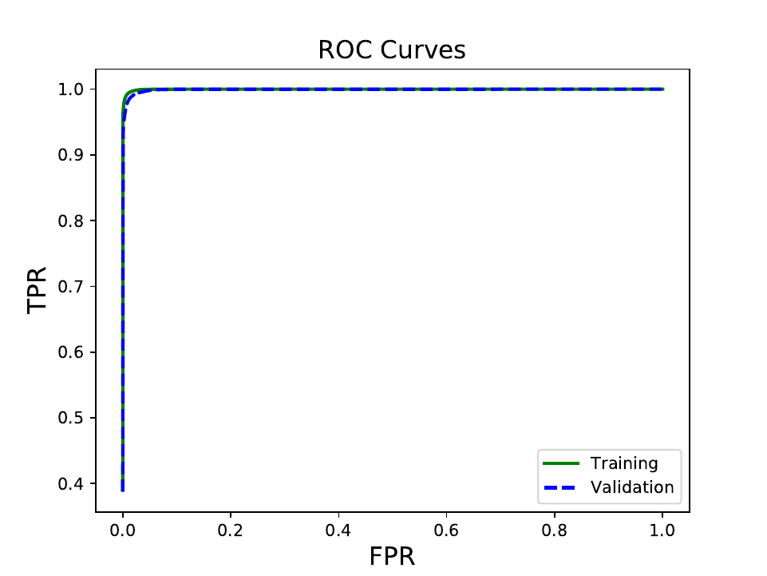
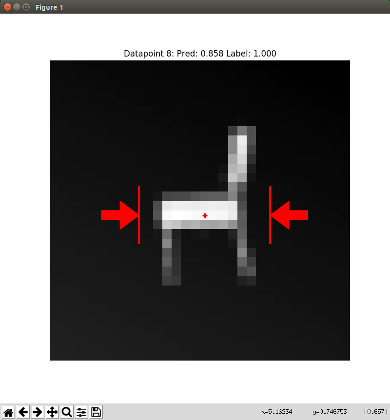

Training
~~~~~~~~
This tutorial walks through the scripts `training.py`_ and `visualize_predictions.py`_ which are included in the `gqcnn` repository under tools/.
The corresponding configurations can be found in cfg/tools/.

First we'll train a network following `training.py`_.

.. _training.py: https://github.com/BerkeleyAutomation/gqcnn/blob/master/tools/training.py
.. _visualize_predictions.py: https://github.com/BerkeleyAutomation/gqcnn/blob/master/tools/visualize_predictions.py

Setup
-----

Dataset
+++++++
Download `the sample dataset`_ from Box to a location of your choice and unzip the dataset.
The sample datset is the Adv-Synth dataset from the `Dex-Net 2.0 RSS Paper`_, which contains roughly 189,000 datatpoints (1.5 GB) from eight objects with challenging geometry.

.. _the sample dataset: https://berkeley.box.com/s/as1bworw6eyn0siw12x1hkn92o1tt00r
.. _Dex-Net 2.0 RSS Paper: https://berkeleyautomation.github.io/dex-net/#dexnet_2

Imports
+++++++
To get started in Python, import the GQCNN, SGDOptimizer, GQCNNAnalyzer, and YamlConfig objects::

	from gqcnn import GQCNN, SGDOptimizer, GQCNNAnalyzer
	from autolab_core import YamlConfig

Configuration Files
+++++++++++++++++++
Scripts in the `gqcnn` package use YAML configuration files to specify parameters.
This tutorial uses three configuration files which have templates in the `gqcnn` repo under the `cfg/tools`_ directory::

       cfg/tools/training.yaml
       cfg/tools/analyze_gqcnn_performance.yaml 
       cfg/tools/gqcnn_prediction_visualizer.yaml

.. _`cfg/tools`: https://github.com/BerkeleyAutomation/gqcnn/blob/master/cfg/tools/

Edit the `dataset_dir` parameter of the training configuration file (ex. training.yaml) to point to the location where you unzipped the dataset::

	dataset_dir: /your/path/to/example/dataset

Also edit the `output_dir` parameter to point to a directory to save the GQ-CNN weights in::

	output_dir: /path/to/your/model/save/location

Then load the training config file in Python by instantiating a YamlConfig object, which allows the parameters to be accessed like a Python dictionary::
	
	train_config = YamlConfig('/path/to/your/training/configuration') # Sample config: 'cfg/tools/training.yaml'

Many objects in the `gqcnn` package are constructed with parameters contained in a single dictionary-like object.
For simplicity, in this example the GQ-CNN parameters (e.g. architecture) and learning parameters (e.g. learning rate) are specified in same training configuration file.

Read the parameters for the GQ-CNN by running::

        gqcnn_config = train_config['gqcnn_config']

Training a Network from Scratch
-------------------------------
GQ-CNNs can be trained using a SGDOptimizer object, which facilitates dynamically loading and queueing datapoints from a dataset during training.

Let's start by training a GQ-CNN from scratch on the Adv-Synth dataset.
There are just two steps:

1) Initialize a GQCNN and a SGDOptimizer::

	gqcnn = GQCNN(gqcnn_config)
	SGDOptimizer = SGDOptimizer(gqcnn, train_config)

2) Train the GQCNN::
	
	with gqcnn.get_tf_graph().as_default():
	     SGDOptimizer.optimize()

You should see output on the terminal logging the minibatch error and occasionally the validation error.
Training on the the Adv-Synth dataset for 25 epochs took 74 minutes on a GeForce GTX 980 GPU.

By default, models will be saved to the location specified in `output_dir` parameter of your training configuration file in a subdirectory with a random 10-character string, like `model_ewlohgukns`.
This prevents overwriting previous models when training multiple times.

Dataset Splits
++++++++++++++
The SGDOptimizer class randomly samples a new training-validation split every time a new model is trained.
This help to prevent overfitting.

There are three options for choosing the dataset splits which can be configured by changing the `data_split_mode` parameter of the training configuration file:

1) **image_wise:** splits by individual datapoints to test memorization.
2) **stable_pose_wise:** splits by the stable resting poses of objects on a table to test generalization to new object orientations.
3) **object_wise:** splits by the object to test generalization to novel objects.

Visualizing Training Progress
-----------------------------
Since training may take hours to days, we provide several tools for monitoring progress.

Python Plotting
+++++++++++++++
One way to monitor progress is the `plot_training_losses.py`_ script, which plots training and validation losses on the same plot.
Find the directory for the model in progress (e.g. `model_ewlohgukns`) and run the following in a new terminal from the root of your `gqcnn` repo::

	python tools/plot_training_losses.py /path/to/your/model/save/location/model_dir

.. _plot_training_losses.py: https://github.com/BerkeleyAutomation/gqcnn/blob/master/tools/plot_training_losses.py

The training and validation curves for the example should look something like this after 25 epochs:

.. image:: ../images/training_losses.png
   :height: 800px
   :width: 800 px
   :scale: 100 %
   :align: center

Tensorboard
+++++++++++
The SGDOptimizer supports Tensorboard to visualize various training parameters such as learning rate, validation error, and minibatch loss.
Tensorboard summaries are saved in the folder `tensorboard_summaries` under the model directory.
For example, if the model directory where the model is being saved is `/home/user/data/models/grasp_quality/model_ewlohgukns`, the summaries will be stored in `/home/user/data/models/grasp_quality/model_ewlohgukns/tensorboard_summaries`. 

The SGDOptimizer automatically starts a local server to feed these summaries.
Once you get the output message::

  Launching Tensorboard, Please navigate to localhost:6006 in your favorite web browser to view summaries

then you can visualize progress by navigating to `localhost:6006` in your favorite web-browser.

.. image:: ../images/tensorboard.png
   :height: 800px
   :width: 800 px
   :scale: 75 %
   :align: center

Prediction
----------
To predict the probability of success, or grasp robustness, of a new datapoint, instantiate a GQCNN object with a path to the saved model (e.g. `/home/user/data/models/grasp_quality/model_ewlohgukns`) and and call the `predict()` function::
	
	images = ['array of images']
	poses = ['corresponding poses']

	gqcnn = GQCNN.load(model_dir)
	output = gqcnn.predict(images, poses)
	pred_p_success = output[:,1]

The images should be specified as an `N`x32x32x1 array and the poses should be specified as an `N`x1 array of depths, where `N` is the number of datapoints to predict.
For an example, load a batch of images from `depth_ims_tf_table_00000.npz` and a batch of corresponding poses from column 2 of `hand_poses_00000.npz` from the Adv-Synth dataset.
	
Analysis
--------
We can benchmark the performance of GQ-CNNs using the GQCNNAnalyzer class::
  
	analysis_config = YamlConfig('/path/to/your/analysis/configuration') # Sample config: 'cfg/tools/analyze_gqcnn_performance.yaml'
        analyzer = GQCNNAnalyzer(analysis_config)
	analyzer.analyze()

The analysis_config contains a list of models to analyze at once along with many analysis parameters. The GQCNNAnalyzer will calculate various metrics such as the model precision, recall, ROC, etc. and plot them. It can also visualize filters at specified layers of the network.

Results on Image-Wise Split
+++++++++++++++++++++++++++
After training for the full 25 epochs, the validation error rate should be approximately 1.3%.

You should also check the Precision-Recall curve (precision_recall.pdf) and Reciever Operative Characteristic (ROC) curve (ROC.pdf) which can be found in the specified output directory for the GQCNNAnalyzer.
The Precision-Recall curve should look as follows:

The ROC curve should look as follows:

Fine-Tuning a Network
---------------------
Fine-tuning a network is similar to training one from scratch.
The only difference is that we load a GQCNN from a model directory instead of creating one from scratch before optimizing::

	gqcnn = GQCNN.load(model_dir)
	SGDOptimizer = SGDOptimizer(gqcnn, train_config)
	with gqcnn.get_tf_graph().as_default():
	     SGDOptimizer.optimize()

Visualizing GQCNN Predictions
-----------------------------
The `gqcnn` package also has the ability to visualize predictions of a GQCNN on a dataset with the GQCNNPredictionVisualizer class.
The GQCNNPredictionVisualizer can visualize false positives, false negatives, true positives, and true negatives on a dataset.
This parameter can be toggled in the provided configuration file.

Let's visualize some predictions following `visualize_predictions.py`_.

.. _visualize_predictions.py: https://github.com/BerkeleyAutomation/gqcnn/blob/master/tools/visualize_predictions.py

To use the GQCNNPredictionVisualizer first import the class and any other useful imports::
	
	from autolab_core import YamlConfig
	from gqcnn import GQCNNPredictionVisualizer

Next, load a the configuration file::

	visualization_config = YamlConfig('/path/to/your/visualization/configuration') # Sample config: 'cfg/tools/gqcnn_prediction_visualizer.yaml'

Finally, create a GQCNNPredictionVisualizer and visualize::

	visualizer = GQCNNPredictionVisualizer(visualization_config)
	visualizer.visualize()

This will load a dataset in batches and individual datapoints will be printed out.
For the specified datapoints(FP/TP/FN/TN) a visualization window will show up showing the object and predicting grasp like this:

