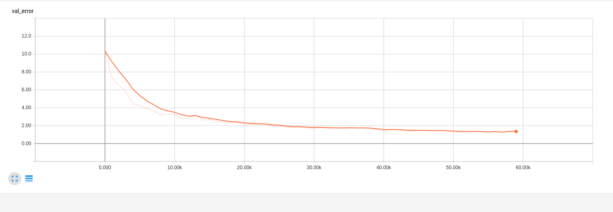

General Workflow
~~~~~~~~~~~~~~~~
The essence of the GQCNN module is to allow modular training of Grasp Quality
Neural Networks. The main idea is to be able to create a Grasp Quality Neural Network
and train it using a DeepOptimizer object. Once a GQCNN is trained it can be used to run grasp quality predictions.
Another key idea is the ability to benchmark the performance of GQCNN's using the GQCNNAnalyzer and to be ably to visualize predictions using the GQCNNPredictionVisualizer.

`Sample scripts of the following tutorials can be found under tools/. The corresponding configurations can be found in cfg/tools/`  

Setup
~~~~~

Imports
+++++++
The following examples assume the GQCNN, DeepOptimizer, GQCNNAnalyzer, and YamlConfig objects have already been imported. An example import::

	from gqcnn import GQCNN, DeepOptimizer, GQCNNAnalyzer
	from core import YamlConfig

Configurations
++++++++++++++
For the following examples we will also assume we have the following configuration files::
	
	train_config = YamlConfig('path/to/training/configuration') # Sample config: 'cfg/tools/train_grasp_quality_cnn.yaml'
	gqcnn_config = train_config['gqcnn_config']
	analysis_config = YamlConfig('path/to/analysis/config') # Sample config: 'cfg/tools/analyze_gqcnn_performance.yaml'
	model_dir = '/path/to/model/dir'

All of the constructors in the GQCNN module expect configurations in the form of a dictionary so we have the freedom
to store our hyperparameters in any form that can be converted to a dictionary. The network configurations and architecture are a subset of the training configuration, hence in this example we are getting them from train_config. The
module is designed this way because architecture and training are closely linked and this way both are stored in one configuration file for simplicity.

Dataset
+++++++
A small sample dataset can be downloaded from `https://berkeley.app.box.com/s/as1bworw6eyn0siw12x1hkn92o1tt00r` as `dexnet_2.0_adv_synth.zip`. The overall download size is approximately 1.5GB Once you have downloaded the dataset, unzipped it, and moved it to where you want, you `must` modify the `dataset_dir` parameter in the training configuration file(ex. train_grasp_quality_cnn.yaml)::

	dataset_dir: /your/path/to/dataset

The `GQCNN` module allows for training with 3 different dataset splits: image-wise(where all images are randomly shuffled and then split into training and test sets), pose-wise(where the unique stable pose labels are shuffled and then split into training and test sets), and object-wise(where the unique objects are shuffled and then split into training and test sets). This can be configured in the configuration file for the DeepOptimizer. `For the various analysis metrics and curves of this dataset such as final validation error, final training error, ROC Curve, precision. recall, etc. please refere to the Results section of the tutorial.`

Training a Network from Scratch
~~~~~~~~~~~~~~~~~~~~~~~~~~~~~~~~
There are two main steps to training a network from scratch:

1) Initialize a GQCNN and a DeepOptimizer to train it::

	gqcnn = GQCNN(gqcnn_config)
	deepOptimizer = DeepOptimizer(gqcnn, train_config)

2) Train the GQCNN::
	
	with gqcnn.get_tf_graph().as_default():
	     deepOptimizer.optimize()

`For and image-wise split on the small sample dataset provided the tensorboard validation error curve should look as follows. The model was trained for 25 epochs. Use this as a benchmark to determine whether or not the model is training properly. More detailed metrics for this dataset can be found in the Anlysis section. Please see the tutorial section Visualizing Training with Tensorboard for detailed steps on how to view the tensorboard output.`

Prediction
~~~~~~~~~~
Once we have trained a model predicting is simply a matter of instantiating a GQCNN with that model and running predictions::
	
	images = ['array of images']
	poses = ['corresponding poses']

	gqcnn = GQCNN.load(model_dir)
	gqcnn.predict(images, poses)
	gqcnn.close_session()

To predict multiple images we could load them from a file directory and call
the predict function in a loop.

Analysis
~~~~~~~~
Finally we can analyze models we have trained using the GQCNNAnalyzer::

	analyzer = GQCNNAnalyzer(analysis_config)
	analyzer.analyze()

The analysis_config contains a list of models to analyze at once along with many analysis parameters. `Make sure to spcify the correct data split type in the configuration file as this will affect which file indices are loaded from the model for analysis.` The GQCNNAnalyzer will calculate various metrics such as the model precision, recall, ROC, etc. and will save them to the specified output directory. It can also visualize filters at specified layers of the network.

`The Analysis metrics and curves such as Final Validation/Training Error, precision, recall, ROC, etc. for the small sample dataset provided on multiple splits can be found under the Results section of the tutorial.`

Fine-Tuning a Network
~~~~~~~~~~~~~~~~~~~~~
Fine tuning a network is similar to training one from scratch. The only difference is that we load a GQCNN from a model directory instead of creating one from scratch::

	gqcnn = GQCNN.load(model_dir)
	deepOptimizer = DeepOptimizer(gqcnn, train_config)
	with gqcnn.get_tf_graph().as_default():
	     deepOptimizer.optimize()

Visualizing Training with Tensorboard
~~~~~~~~~~~~~~~~~~~~~~~~~~~~~~~~~~~~~
The DeepOptimizer is designed with support for Tensorboard to allow for visualization of various training 
parameters such as learning rate, validation error, minibatch loss, and minibatch error. These tensorboard summaries are 
saved in a folder labeled `tensorboard_summaries` in the model directory. For example, if the model directory where the model is being saved is `/home/user/Data/models/grasp_quality/model_qwueio`, the summaries will be stored in `/home/user/Data/models/grasp_quality/model_qwueio/tensorboard_summaries`. 

The DeepOptimizer will automatically start a local server to feed these summaries. Once you see this output message, `Launching Tensorboard, Please navigate to localhost:6006 in your favorite web browser to view summaries`, simply navigate to `localhost:6006` in your favorite web-browser to start visualizing.

.. image:: ../images/tensorboard.png
   :height: 800px
   :width: 800 px
   :scale: 75 %
   :align: center

Visualizing Specific GQCNN Predictions
~~~~~~~~~~~~~~~~~~~~~~~~~~~~~~~~~~~~~~
The `GQCNN` module also has the ability to visualize specific predictions of a GQCNN on a dataset. This can be done through use of the GQCNNPredictionVisualizer. The GQCNNPredictionVisualizer can visualize false positives, false negatives, true positives, and true negatives. This paramemeter can be toggled in the provided configuration file.

To use the GQCNNPredictionVisualizer first import the class and any other useful imports::
	
	import logging
	from core import YamlConfig
	from gqcnn import GQCNNPredictionVisualizer

Next load a valid configuration file::

	visualization_config = YamlConfig('cfg/tools/gqcnn_prediction_visualizer.yaml')

Finally we can create a GQCNNPredictionVisualizer and visualize::

	logging.info('Beginning Visualization')
	visualizer = GQCNNPredictionVisualizer(visualization_config)
	visualizer.visualize()

This will start the visualization. Data will be loaded from the dataset in batches by file and metrics will be calculated and printed out. For the specified datapoints(FP/TP/FN/TN) a visualization window will show up showing the object and predicting grasp like so:

.. image:: ../images/sample_grasp.png
   :height: 800px
   :width: 800 px
   :scale: 75 %
   :align: center

Results
~~~~~~~
The Precision-Recall curve can be found in precision_recall.pdf and can be found in the specified output directory for the GQCNNAnalyzer. The ROC curve can be found in ROC.pdf. the final Validation and Training error rates are printed to the console both at the end of training and by the GQCNNAnalyzer.

The following metrics and curves are for the small sample dataset provided and the corresponding splits:

Image-Wise Split
++++++++++++++++
The `Final Validation Error Rate is 1.355` and the `Final Training Error Rate is 0.804`.

The Precision-Recall curve should look as follows:

.. image:: ../images/precision-recall-1.png
   :height: 800px
   :width: 800 px
   :scale: 75 %
   :align: center

The ROC curve should look as follows:

.. image:: ../images/roc-1.png
   :height: 800px
   :width: 800 px
   :scale: 75 %
   :align: center
